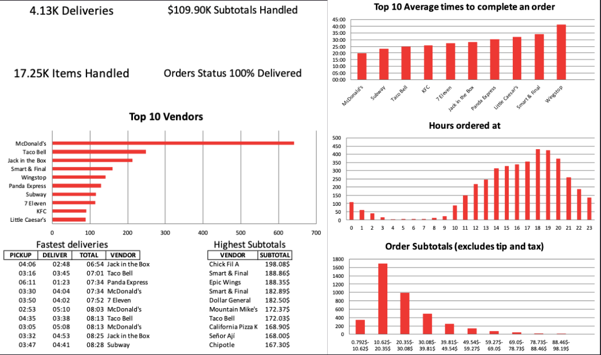

# Door Dash Data Report

This code was used to instantly clean and create a report based on the dataset provided by DoorDash. Upon request, one can download their personal data collected by DoorDash. It is saved as `dasher_delivery_information.csv` when downloaded and its then transformed into a `xlsx` document after running both scripts in this file.

The result are as follows as of November 2022:

