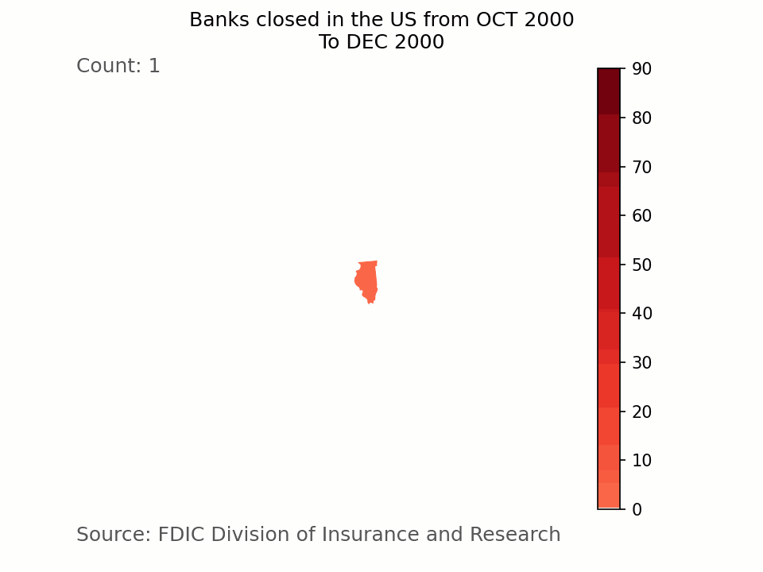

This repository contains a collection of visualizations I have created based on some of my interest and my pursue of different techniques

The code is created using Python using these libraries libraries:

-   Matplotlib
-   Seaborn
-   Plotly
-   Geopandas
-   Openpyxl

Failed Banks in the US:

 

DoorDash Data :

